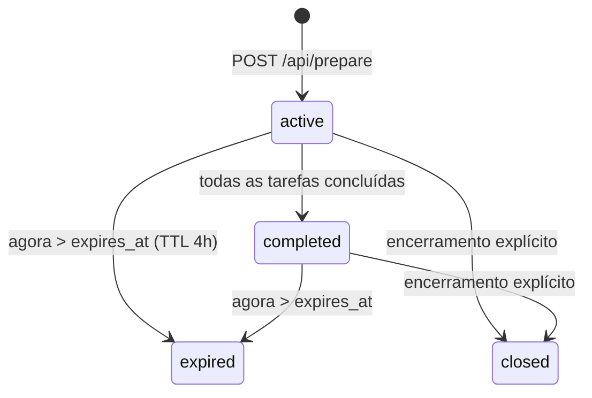
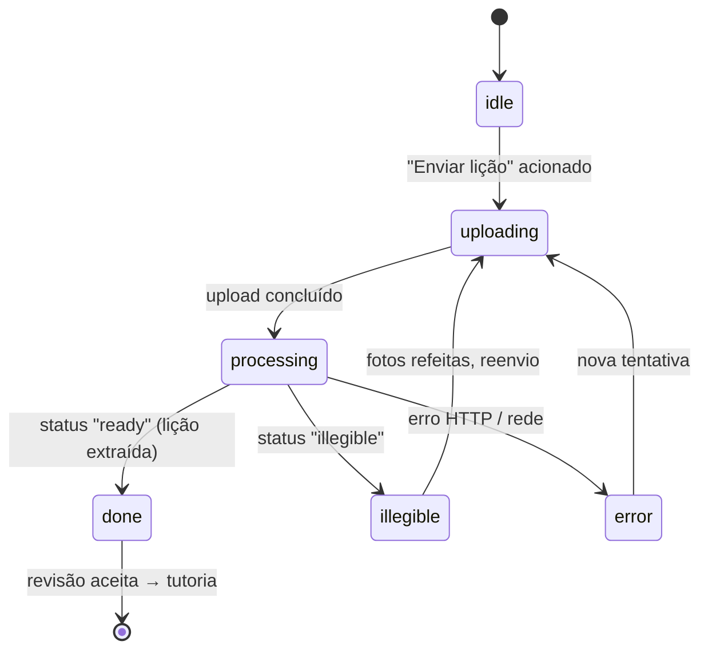

# Professor Virtual — Documentação do App

## 1. O que é

O **Professor Virtual** é um tutor de lição de casa por **voz e câmera** para crianças de 8 a 11 anos. A criança interage falando e mostrando o caderno à câmera — **sem digitar nada**. O sistema guia a lição tarefa por tarefa, corrige respostas, dá dicas progressivas e responde sempre com **áudio falado + imagem ilustrativa**.

Objetivo central: a criança faz a lição sozinha, do início ao fim, sem depender de um adulto.

**Papel das máquinas — definição que vale para o documento inteiro:** o **desktop é onde roda o backend** (o servidor). Persistência em arquivos JSON — sem banco de dados, sem nuvem. É um MVP validado em uso real, mantido por um dev solo.

- **Hoje:** por circunstância, o cliente (React no Chrome, com câmera USB) roda **na mesma máquina** que o backend. É uma coincidência de implantação, não uma característica da arquitetura.
- **Alvo:** o desktop passa a ser **somente servidor** — backend FastAPI, sem nenhuma interface de usuário. **Toda a experiência do usuário** (preparação da lição, tutoria e modo adulto) acontece **no dispositivo cliente** (a placa embarcada), que fala com o desktop pela rede local via a API da §7.

### 1.1 Público deste documento

Este documento é **autossuficiente**: descreve o comportamento completo do sistema sem exigir leitura do código. Ele serve tanto para entender o produto quanto como **especificação de referência para reimplementar o cliente em outra plataforma** (por exemplo, um dispositivo embarcado com tela, câmera, microfone e alto-falante). Para esse caso, as seções críticas são:

- §2 — Divisão de responsabilidades (o que é do servidor, o que é do cliente)
- §6 — Máquinas de estados do servidor
- §7 — Contrato da API HTTP (esquemas, erros e efeitos colaterais)
- §8 — Formatos de mídia na rede
- §9 — Especificação de comportamento do cliente (fases, temporizações, sons, erros)

**Escopo do cliente — leia antes de recortar:** o cliente compreende **duas experiências, e uma reimplementação deve cobrir as duas**: a **preparação da lição** (fotografar páginas, revisar, refazer, enviar — §9.8) e a **tutoria** (§9.2–§9.7), incluindo o modo adulto do failsafe (§9.6). A extração das tarefas em si é sempre trabalho do backend (§7.4) — "preparação no cliente" significa apenas as telas de captura e revisão, nunca a IA. **Nenhuma parte da experiência do usuário permanece no desktop**: no estado-alvo, o desktop executa exclusivamente o backend, e o React atual deixa de ser usado (fica no repositório como implementação de referência do comportamento).

**Caminhos de arquivo:** este documento é a especificação completa — nenhuma leitura adicional é obrigatória. Quando ele cita arquivos do repositório (para inspeção opcional ou cópia de assets), usa caminhos absolutos da máquina do desktop, onde o repositório reside em:

```text
/home/deniellmed/projetos/licao_casa
```

Notas de portabilidade para hardware embarcado estão no **Apêndice B**.

---

## 2. Arquitetura e divisão de responsabilidades

**Princípio único e inegociável: o backend é a fonte de verdade de tudo que é pedagógico e persistente. O cliente nunca decide nada — captura mídia, exibe respostas e espelha o estado do servidor.**

```text
Câmera + microfone + tela + alto-falante
            │
     CLIENTE — toda a experiência do usuário
     (hoje: React no Chrome; alvo: dispositivo embarcado)
     interface, captura, reprodução,
     estado transitório de UI
            │  HTTP /api/... (rede local)
            ▼
     BACKEND — DESKTOP (Python + FastAPI)
     regras pedagógicas, máquina de estados,
     persistência JSON, chaves de API
            │
            ▼
     APIs externas de IA (internet)
```

A seta HTTP do meio é a **única** ligação entre as duas metades. Hoje ela atravessa a própria máquina (cliente e backend coincidem no desktop); no alvo, atravessa a rede local (dispositivo → desktop). Nada mais muda: o contrato (§7) e a divisão de responsabilidades abaixo são idênticos nos dois cenários — é exatamente isso que torna a migração possível sem tocar no backend.

| Responsabilidade | Backend | Cliente |
|---|---|---|
| Avaliar a resposta da criança (veredicto) | ✅ | ❌ |
| Decidir avanço de tarefa, failsafe, conclusão | ✅ | ❌ |
| Contadores de erro/falha/reexplicação | ✅ | ❌ |
| Estado canônico (lição, progresso, histórico) | ✅ persiste em JSON | ❌ só espelha em RAM |
| Chaves das APIs externas e PIN do adulto | ✅ somente no servidor | ❌ nunca |
| Gerar áudio da explicação (TTS) e imagem pedagógica | ✅ | ❌ |
| Capturar foto e gravar áudio da criança | ❌ | ✅ |
| Tocar áudio, mostrar imagem, animar transições | ❌ | ✅ |
| Sons de interface (acerto, erro, espera, convite) | ❌ | ✅ assets locais |
| Fases transitórias ("gravando", "processando") | ❌ | ✅ RAM apenas |
| Detectar *que* houve avanço (para animar) | ❌ decide | ✅ detecta comparando estado |

Consequências práticas:

- Se o cliente desligar/recarregar, **nada se perde**: ao religar, ele re-hidrata via `GET /api/state` + `GET /api/lesson` e retoma do ponto exato — inclusive no meio de um failsafe.
- Se o backend cair, o cliente não pode continuar a tutoria: deve exibir estado de desconexão e tentar reconectar (ver §9.7).
- O cliente **nunca** replica as regras das seções §5 e §6 — apenas reage ao estado que o servidor devolve. Reimplementar essas regras no cliente é um erro de arquitetura: criaria duas fontes de verdade.

---

## 3. Tecnologias, linguagens e APIs externas

| Camada | Linguagem | Stack |
|---|---|---|
| **Backend** | Python | FastAPI (monolito assíncrono), Pydantic (validação), aiofiles (I/O assíncrono), uvicorn |
| **Cliente atual** | TypeScript | React 19 + Vite, zustand (estado), react-webcam (câmera), axios (HTTP) |
| **Persistência** | — | Arquivos JSON locais em `/home/deniellmed/projetos/licao_casa/data/` (no desktop) |

O backend consome **três APIs externas de IA**, cada uma atrás de um módulo adaptador próprio (o resto do código nunca fala com a API diretamente):

1. **Compreensão multimodal** — extrai a estrutura da lição a partir das fotos das páginas e avalia cada turno da criança (áudio ou foto), devolvendo um veredicto pedagógico estruturado.
2. **Síntese de voz (TTS)** — converte a explicação textual do tutor em áudio MP3 em português brasileiro.
3. **Geração de imagem** — cria a ilustração pedagógica que acompanha cada explicação.

> As credenciais ficam em um `.env` local lido por configuração tipada. Este documento **não especifica quais modelos ou fornecedores são usados** — é detalhe de configuração do backend, invisível ao contrato da API e ao cliente.

Configurações relevantes do backend (valores padrão): TTL da sessão **4 horas**; limite de reexplicações por tarefa **2**; turnos de histórico enviados à avaliação **6**; PIN do adulto (4–8 dígitos, obrigatório para o modo adulto).

---

## 4. Fluxo de uso

### 4.1 Preparação da lição

1. Fotografa-se cada página da lição (até **20 páginas**, JPEG/PNG, máx. **10 MB** cada). O cliente permite revisar, excluir e refazer fotos antes de enviar.
2. `POST /api/prepare` envia todas as fotos. O backend extrai a estrutura da lição via API multimodal: **itens** (grupos de exercícios) contendo **tarefas** (perguntas individuais), cada uma com enunciado e metadados (disciplina, origem, página).
3. Se alguma página estiver ilegível, o backend devolve os índices e o cliente pede para refazer só aquelas.
4. Com a extração aceita na revisão, começa a tutoria.

Nesse momento o backend inicializa a sessão: grava `lesson_tasks.json` (a lição), `state.json` (posição = primeira tarefa do primeiro item; validade de 4 h) e `conversation.json` (diário de turnos, zerado).

### 4.2 Tutoria

A tela mostra: enunciado da tarefa atual (com progresso "tarefa X de Y"), preview da câmera, a imagem ilustrativa do tutor e **dois únicos comandos**: gravar áudio e tirar foto.

Cada interação é um **turno** (`POST /api/turn`) com **exatamente uma** entrada — áudio **ou** imagem. O backend avalia, aplica as transições de estado e devolve **sempre áudio + imagem** (em turnos `correct`, a imagem é uma celebração pré-gerada local — custo e latência zero). O cliente toca o áudio, mostra a imagem e o feedback (sons locais + borda verde/vermelha).

Quando todas as tarefas terminam, `session_status` vira `completed` e o cliente mostra a celebração final.

---

## 5. Regras pedagógicas (implementadas no backend)

1. **Avanço só com foto.** Resposta falada correta **nunca** avança: o tutor confirma e pede foto do caderno (`waiting_for_photo = true`). Só uma **foto avaliada como correta** completa a tarefa e avança — garante que a resposta está escrita no caderno.
2. **Erros progressivos.** Erro por **foto** incrementa `wrong_answer_count`: no 2º o tutor pede foto para diagnosticar; no **3º dispara o failsafe** (intervenção adulta). Erro por **áudio** gera só feedback verbal, sem contar.
3. **Anti-loop de explicações.** Pedido de explicação (`teach`) por áudio, quando **já houve** um `teach` anterior na mesma tarefa, incrementa `clarification_count`; no limite (2), o tutor encerra o ciclo verbal anexando à explicação: *"Agora me mostra uma foto do caderno para eu te ajudar melhor."* e liga `waiting_for_photo`. Um `teach` após foto não conta (a criança acabou de mandar foto).
4. **Falhas técnicas contam.** Entrada ininteligível (`unidentifiable`) e erros das APIs externas incrementam `technical_failure_count`; **3 falhas disparam o failsafe**.
5. **Atomicidade do turno.** Se a geração de áudio/imagem falhar **depois** da avaliação, o veredicto daquele turno é **descartado** (restaura-se o estado pré-transição e conta-se falha técnica): a criança nunca recebeu a resposta, logo a tarefa não pode completar, avançar nem acumular contadores de explicação.
6. **Memória por tarefa.** O histórico enviado à avaliação é filtrado pela tarefa atual (item **e** tarefa) e limitado aos últimos 6 turnos, lido de `conversation.json`. Diário corrompido ou de lição anterior é descartado silenciosamente — nunca derruba um turno.
7. **Repetição gratuita.** "Ouvir de novo" retoca o último áudio já em memória do cliente — sem chamada de API, sem criar turno, sem tocar em contador algum.

---

## 6. Máquinas de estados (servidor)

Todas as transições abaixo vivem no backend como **funções puras** (recebem o estado, devolvem cópia atualizada — sem I/O). O cliente apenas as observa via API.

### 6.1 Sessão (`session_status`)



- Expiração é checada **em toda leitura** de `GET /api/state` (e persistida na hora).
- Não existe transição `expired → closed`.
- `POST /api/turn` exige sessão `active` (senão **409**).

### 6.2 Item (grupo de tarefas)

`pending → in_progress` (no primeiro turno do item) `→ completed` (última tarefa do item concluída).

### 6.3 Tarefa

`pending → completed`, com `completion_source` = `"model"` (foto correta) ou `"adult"` (resolve do adulto). Cada tarefa carrega `wrong_answer_count`, `technical_failure_count` e `clarification_count` — **zerados na conclusão**.

**Invariante central:** só se avança se a tarefa atual estiver `completed`. A ordem de navegação é a **ordem natural dos IDs** (numérica, não lexicográfica: `item_2` antes de `item_10`): próxima tarefa do item → primeira tarefa do item seguinte → sessão `completed`.

### 6.4 Flags de sessão

| Flag | Liga quando | Desliga quando |
|---|---|---|
| `waiting_for_photo` | resposta falada correta; 2º erro por foto; limite de reexplicações; entrada ininteligível | chega qualquer foto; resolve do adulto (para a próxima tarefa não herdar a flag) |
| `adult_intervention_required` | 3 erros por foto OU 3 falhas técnicas na mesma tarefa | somente pelo resolve do adulto com PIN |

### 6.5 Transições por turno: veredicto × tipo de entrada

| Veredicto | Entrada = áudio | Entrada = foto |
|---|---|---|
| `correct` | Confirma e pede foto (`waiting_for_photo=true`). **Nunca avança.** | Completa a tarefa e avança; se era a última, sessão `completed`. Imagem da resposta = celebração local. |
| `wrong` | Feedback corretivo verbal. Nenhum contador muda. | `wrong_answer_count += 1`; `==2` → pede foto; `>=3` → failsafe. |
| `teach` | Se já houve `teach` na tarefa: `clarification_count += 1`; no limite → pede foto + anexa convite ao texto. | Explica normalmente; não conta reexplicação. |
| `unidentifiable` | `technical_failure_count += 1` (`>=3` → failsafe) e pede foto. | Idem. |

---

## 7. Contrato da API HTTP

Base: o servidor FastAPI escuta na porta 8000. O cliente atual usa caminhos relativos `/api/...` atrás do proxy de desenvolvimento do Vite; **um cliente remoto deve usar o IP do servidor na rede local** (ex.: `http://192.168.x.y:8000`), o que exige o backend escutando em `0.0.0.0` e porta liberada no firewall. Não há autenticação nos endpoints da criança (rede local confiável, MVP); o modo adulto exige PIN.

> **Aviso de segurança (registrado no audit da fase 01 deste repositório):** os riscos hoje aceitos do backend — sem autenticação, sem CORS/CSRF, sem rate limit, sem TLS, `data/` em texto puro — foram aceitos **porque o servidor só escutava em loopback**. Ao expor em `0.0.0.0` para atender o dispositivo, todos eles passam a ser alcançáveis por qualquer máquina da rede local. Antes de a migração entrar em uso real, essa exposição deve ser re-avaliada (no mínimo: um token simples compartilhado entre dispositivo e backend, e firewall restringindo a porta aos IPs esperados).

Convenção de erro do FastAPI: falhas retornam JSON `{"detail": "mensagem"}` com o código HTTP indicado.

### 7.1 `GET /api/health`

Sem parâmetros. Resposta `200`: `{"status": "ok", "version": "0.1.0"}`. O cliente usa para monitorar conectividade (ver §9.7).

### 7.2 `GET /api/state`

Sem parâmetros. Respostas `200`:

- Sem sessão: `{"status": "no_session"}`
- Estado corrompido: `{"status": "invalid_state", "error": "..."}` → o remédio é refazer a preparação
- Sessão existente: o objeto de estado completo:

```json
{
  "session_id": "uuid",
  "student_id": "default",
  "student_name": "Aluno",
  "lesson_id": "uuid",
  "session_status": "active | completed | closed | expired",
  "waiting_for_photo": false,
  "adult_intervention_required": false,
  "created_at": "ISO-8601", "updated_at": "ISO-8601", "expires_at": "ISO-8601",
  "current_item": "item_1",
  "current_tarefa": "item_1_task_1",
  "item_progress": {
    "item_1": {
      "status": "pending | in_progress | completed",
      "tarefas": {
        "item_1_task_1": {
          "status": "pending | completed",
          "image_uri": null,
          "wrong_answer_count": 0,
          "technical_failure_count": 0,
          "clarification_count": 0,
          "completion_source": null
        }
      }
    }
  },
  "usage_counters": { "llm_calls": 0, "image_generation_calls": 0, "tts_chars_used": 0 }
}
```

**Efeito colateral:** a expiração é avaliada nesta leitura; se vencida, o servidor grava `session_status: "expired"` antes de responder.

### 7.3 `GET /api/lesson`

Sem parâmetros. Resposta `200`: `{"status": "no_lesson"}` ou a lição completa:

```json
{
  "lesson_id": "uuid",
  "created_at": "ISO-8601",
  "source_pages": ["data/images/page_1.jpg", "..."],
  "items": {
    "item_1": {
      "titulo": "Exercício 1",
      "enunciado": "texto do item",
      "tarefas": {
        "item_1_task_1": {
          "enunciado": "texto da pergunta",
          "origem": "livro X | null",
          "disciplina": "matemática | null",
          "pagina": 12
        }
      }
    }
  }
}
```

Atenção: a resposta de sucesso **não tem** campo `status` — o cliente detecta que há lição pela **presença de `lesson_id`** no JSON.

### 7.4 `POST /api/prepare`

Multipart form: campo **`files`** repetido, um por página, na ordem das páginas. Aceita `image/jpeg` e `image/png`; máx. 20 arquivos; máx. 10 MB cada.

| Resposta | Significado |
|---|---|
| `200` `{"status": "ready", "summary": <lição, mesmo esquema de 7.3>}` | Lição extraída; sessão inicializada |
| `200` `{"status": "illegible", "illegible_pages": [índices 0-based]}` | Refazer as páginas indicadas e reenviar **todas** |
| `400` | Tipo de arquivo inválido, mais de 20 arquivos ou arquivo > 10 MB |
| `422` | Nenhuma tarefa pôde ser extraída das imagens |

**Efeitos colaterais no sucesso:** grava as fotos em `data/images/` (sob a raiz do repositório no desktop), cria `lesson_tasks.json`, cria `state.json` novo (posição inicial, `expires_at = agora + 4h`) e zera `conversation.json`. Preparar de novo **substitui** a sessão anterior.

### 7.5 `POST /api/turn` — o coração do sistema

Multipart form:

| Campo | Tipo | Obrigatório |
|---|---|---|
| `session_id` | texto (o `session_id` de `GET /api/state`) | sim |
| `audio` | arquivo de áudio | exatamente um dos dois |
| `image` | arquivo de imagem | exatamente um dos dois |

Resposta `200`:

```json
{
  "veredicto": "correct | wrong | teach | unidentifiable",
  "texto_explicacao": "fala do tutor em pt-BR",
  "audio_base64": "<MP3 em base64 — sempre presente>",
  "image_base64": "<PNG em base64 — sempre presente>",
  "session_status": "active | completed",
  "current_item": "item após o turno",
  "current_tarefa": "tarefa após o turno",
  "wrong_answer_count": 0,
  "adult_intervention_required": false
}
```

`current_item`/`current_tarefa` já refletem o avanço, quando houve. Compare com a posição capturada **antes** do envio para detectar avanço (ver §9.4).

Erros — **atenção aos efeitos colaterais**:

| Código | Causa | Efeito colateral persistido |
|---|---|---|
| `400` | zero ou duas entradas enviadas | nenhum |
| `404` | sem sessão ativa ou sem lição | nenhum |
| `409` | sessão não está `active`, **ou** failsafe já pendente | nenhum |
| `502` | falha da API de avaliação **ou** da geração de áudio/imagem | **SIM**: `technical_failure_count` incrementado; na 3ª falha, `adult_intervention_required = true`. Nas falhas de geração, o veredicto do turno foi **descartado** (estado pedagógico restaurado ao pré-turno). |

**Regra obrigatória do cliente:** após qualquer erro HTTP em que o servidor respondeu (em especial `502` e `409`), re-consultar `GET /api/state` — um failsafe pode ter sido ligado e a interface precisa refletir isso imediatamente. Erro **sem** resposta (rede caiu) não tem efeito no servidor... *se* a requisição não chegou; como o cliente não tem como saber, o comportamento seguro é re-consultar o estado ao reconectar (ver também §10, limitações).

### 7.6 `POST /api/adult/verify`

Body JSON: `{"pin": "1234"}`. Valida o PIN sem tocar no estado.

| Código | Significado |
|---|---|
| `200` `{"status": "ok"}` | PIN correto |
| `403` | PIN incorreto |
| `503` | PIN não configurado no servidor, ou configurado fora do formato 4–8 dígitos |

O PIN nunca aparece em nenhuma resposta ou log.

### 7.7 `POST /api/adult/resolve`

Body JSON: `{"pin": "1234"}`. Completa a tarefa atual com `completion_source: "adult"`, desliga o failsafe, limpa `waiting_for_photo` e avança.

Resposta `200`:

```json
{
  "status": "resolved",
  "session_status": "active | completed",
  "current_item": "...",
  "current_tarefa": "...",
  "adult_intervention_required": false
}
```

Erros: `403`/`503` como no verify; `409` se a sessão não está `active` **ou não há failsafe ativo** — o servidor é a única autoridade sobre avanço: sem failsafe, nada é gravado.

---

## 8. Formatos de mídia na rede

| Direção | Mídia | Formato no contrato atual | Observações para outros clientes |
|---|---|---|---|
| Cliente → servidor | Foto (turno e preparação) | JPEG (o cliente atual envia screenshots JPEG; preparação aceita JPEG/PNG) | Qualquer JPEG legível serve. A resolução **1358×1920** usada hoje é uma escolha do cliente web (enquadrar página em retrato) — **não é exigência da API**. O que importa: página inteira enquadrada, foco e legibilidade. |
| Cliente → servidor | Áudio da criança | WebM/Opus (`audio/webm`), até 30 s | O backend **não decodifica**: repassa bytes + MIME type diretamente à API multimodal. Outros formatos (ex.: WAV/PCM) tendem a funcionar se a API externa os aceitar — **validar formalmente antes de adotar**. |
| Servidor → cliente | Voz do tutor | MP3 em **base64** dentro do JSON de `/api/turn` | Sempre presente em turno bem-sucedido. |
| Servidor → cliente | Imagem do tutor | PNG em **base64** dentro do mesmo JSON | Sempre presente; em `correct` é uma celebração local pré-gerada. |

**Limitação conhecida do contrato atual:** embutir as mídias em base64 num único JSON custa ~33% de volume extra e obriga o cliente a manter a resposta inteira em memória. Para o navegador é irrelevante; para clientes com pouca RAM é um custo real.

**Evoluções recomendadas do contrato** (exigem mudança no backend; **nada disso existe hoje** — o contrato vigente é o descrito acima):

1. `/api/turn` devolver um JSON pequeno com o resultado e **URLs de mídia** (ex.: `audio_url`, `image_url`) que o cliente baixa separadamente, em streaming, em vez de base64 embutido;
2. um **`request_id` por turno com idempotência**: reenviar a mesma requisição devolve o resultado já processado em vez de criar um segundo turno — pré-requisito para retry seguro em rede sem fio;
3. o backend **redimensionar a imagem** para a resolução real da tela do cliente antes de enviar;
4. opcionalmente, o `/api/prepare` aceitar **upload página a página** com finalização, para o cliente não precisar manter todas as fotos em memória ao mesmo tempo.

### 8.1 Latência, timeouts e ordens de grandeza

Fundamentais para configurar o cliente HTTP de qualquer reimplementação:

| Operação | Latência típica | Orientação ao cliente |
|---|---|---|
| `POST /api/turn` | **dezenas de segundos** — encadeia avaliação multimodal + TTS + geração de imagem. A UI atual mostra "Quase lá..." aos 30 s e **não tem timeout** (espera indefinidamente). | Timeout generoso (≥ 120 s). **Nunca fazer retry automático**: sem idempotência (§10), o retry vira um segundo turno. Timeout estourado → tratar como erro sem resposta (§9.7). |
| `POST /api/prepare` | proporcional ao nº de páginas; a UI cicla mensagens de progresso a cada 3 s e também espera sem timeout. | Timeout ainda maior (≥ 180 s para 20 páginas) ou envio com acompanhamento. Retry de prepare é seguro: apenas substitui a sessão. |
| `GET /api/state`, `/api/lesson`, `/api/health` | milissegundos (leitura de arquivo local) | Timeout curto normal (~5 s). |

Ordens de grandeza dos payloads (planejamento de RAM):

- **Foto enviada:** JPEG 1358×1920 com qualidade 0.92 → tipicamente centenas de KB por página.
- **Resposta do turno:** o JSON inteiro chega de uma vez; o PNG em base64 pode passar de **1 MB** e o MP3 fica em dezenas a centenas de KB. O cliente precisa acomodar JSON bruto + mídias decodificadas simultaneamente.
- **Lição (`GET /api/lesson`) e estado:** JSON pequeno (KBs).

---

## 9. Especificação de comportamento do cliente

Esta seção descreve o que o cliente atual faz, com as temporizações exatas — é a referência para reimplementação. Nenhum item abaixo envolve decisão pedagógica; tudo é interface e orquestração.

### 9.1 Boot / hidratação

Ao iniciar (ou após recarga):

1. `GET /api/health` — confirma que o backend responde;
2. `GET /api/state` + `GET /api/lesson` em paralelo;
3. Roteia a interface:
   - sem sessão utilizável ou sem lição → **tela de preparação**;
   - `session_status = "completed"` → **tela de celebração final**;
   - `adult_intervention_required = true` → **overlay de failsafe** (direto, sem passar pela tutoria);
   - senão → **tutoria**, na tarefa `current_item`/`current_tarefa`.

Detalhe do cliente atual: a tela de revisão da lição só reaparece se a sessão ainda não teve nenhum turno (detectado por `usage_counters` zerados e todos os itens `pending`); uma sessão já iniciada volta direto à tutoria.

### 9.2 Máquina de fases da interface de tutoria

Estado transitório, vive só na RAM do cliente:

```mermaid
stateDiagram-v2
    [*] --> idle
    idle --> recording : botão de gravar
    recording --> processing : gravação encerrada e enviada
    idle --> processing : foto capturada e enviada
    processing --> showing_response : resposta 200 chegou
    processing --> idle : erro (toast 5 s; re-hidratar se houve resposta)
    showing_response --> transitioning : áudio terminou E houve avanço
    showing_response --> idle : áudio terminou, sem avanço
    transitioning --> idle : após 1,5 s
```

Comandos de gravação e foto ficam **desabilitados** fora de `idle`.

### 9.3 Temporizações e sons (inventário completo)

| Momento | Comportamento | Parâmetro |
|---|---|---|
| Gravação de áudio | contador visível; **auto-stop e envio automático** | limite **30 s** |
| Envio do turno | toca áudio de "entretenimento" local em loop, volume baixo | troca para a 2ª faixa após **15 s**; para quando a resposta chega |
| Resposta chega | feedback imediato conforme veredicto: som de acerto / som neutro de erro + borda verde/vermelha | `correct` / `wrong`; `teach` e `unidentifiable` não têm som de feedback |
| Voz do tutor | decodifica o MP3 base64 e toca; **watchdog**: se a reprodução não começar, tratar como falha e seguir o fluxo | timeout **10 s** |
| Avanço de tarefa | som de "convite" (sorteado entre 5 faixas locais), segura a tela da tarefa concluída, depois entra na nova tarefa | espera **1,5 s** |
| Erro (toast) | mensagem some sozinha | **5 s** |
| Inatividade em `idle` | toca som de lembrete local | **120 s**, no máximo **1× por tarefa**, **desativado durante failsafe** |
| Conectividade | `GET /api/health` periódico; indicador de conexão | a cada **10 s** |

Assets de som locais do cliente (nenhum vem de API; os arquivos MP3 estão em `/home/deniellmed/projetos/licao_casa/frontend/public/sounds/` e **devem ser copiados** para qualquer reimplementação):

| Arquivo | Gatilho |
|---|---|
| `correct-ding.mp3` | veredicto `correct` ao chegar a resposta |
| `wrong-neutral.mp3` | veredicto `wrong` ao chegar a resposta |
| `invitation-01..05.mp3` | entrada em nova tarefa (sorteia 1 dos 5) |
| `entertainment-01.mp3` / `entertainment-02.mp3` | espera do turno (loop, volume baixo; troca 1→2 aos 15 s) |
| `reminder.mp3` | 120 s de inatividade em `idle` (1× por tarefa) |
| `chime.mp3` | extração da lição concluída com sucesso (banner de revisão) |
| `failsafe-01.mp3` | **existe nos assets mas o cliente atual não o toca** — reservado para o overlay de failsafe; tratar como opcional |

### 9.4 Detecção de avanço (regra fina, fonte de bugs se ignorada)

1. **Antes** de enviar o turno, capture `(current_item, current_tarefa)`.
2. Após a resposta, toque o áudio do tutor **até o fim** e re-consulte `GET /api/state`.
3. **Só depois que ambos terminarem** (áudio E re-hidratação — em qualquer ordem), compare a posição nova com a capturada:
   - mudou e a sessão não completou → fase `transitioning` (convite + 1,5 s);
   - não mudou, sessão completou, ou a re-hidratação falhou → volta a `idle` preservando resposta/imagem/replay da tarefa atual.
4. Durante `showing_response`/`transitioning`, o **cabeçalho continua mostrando a tarefa concluída** (a posição capturada no passo 1), para celebração, imagem e áudio ficarem consistentes com o enunciado na tela. Só ao voltar a `idle` o cabeçalho troca para a nova tarefa.

Decidir o avanço antes da re-hidratação terminar causa a corrida clássica: o áudio acaba, o estado local ainda é o antigo, a interface conclui "não avançou" e logo depois a tela troca de tarefa sem transição.

### 9.5 Replay ("Ouvir de novo")

Disponível apenas em `idle`, quando existe resposta com áudio na memória. Retoca o MP3 já recebido. **Proibido**: chamar API, criar turno, alterar qualquer contador. Ao entrar em nova tarefa, o replay e a imagem da tarefa anterior são descartados.

### 9.6 Failsafe (visão do cliente)

Quando `adult_intervention_required = true` e a fase é `idle` (deixa o áudio da 3ª explicação terminar antes):

- O overlay **substitui completamente** a interface de tutoria — nenhum comando da criança permanece acessível, por toque ou teclado. A criança **não tem** como fechar o overlay.
- Fluxo em três telas: **mensagem** para a criança ("chame um adulto") → **teclado de PIN** (4–8 dígitos) → **tela do adulto** com a ação de resolver.
- PIN validado via `POST /api/adult/verify`; a resolução via `POST /api/adult/resolve`.
- O overlay só sai de cena depois que uma **re-hidratação confirma** `adult_intervention_required = false` — nunca por decisão local.
- Após resolver: limpa os resíduos da tarefa que falhou (imagem, replay), entra na próxima tarefa pela transição normal **sem som de comemoração** (a conquista não foi da criança). Se a tarefa resolvida era a última, vai direto à tela final.

### 9.7 Tratamento de erros e desconexão

| Situação | Comportamento exigido |
|---|---|
| Erro HTTP **com** resposta do servidor (4xx/5xx) | Re-consultar `GET /api/state` antes de mostrar qualquer coisa: se o failsafe ligou, o overlay **é** o aviso (não mostrar toast técnico por cima). Senão, toast de 5 s com a mensagem. |
| Erro **sem** resposta (rede caiu) | Toast de 5 s; ao reconectar, re-hidratar. |
| Backend inacessível (health falhando) | Indicador de desconexão; a tutoria não prossegue; tentar reconectar e re-hidratar ao voltar. |
| Áudio da resposta não toca | Nunca travar o fluxo: registrar a falha, avisar, e seguir o mesmo caminho de fim-de-áudio (o watchdog de 10 s garante isso). |
| Internet caiu, mas a rede local continua | O backend responde, mas as chamadas de IA falham → o turno volta `502` (com os efeitos colaterais de §7.5). O cliente trata como qualquer 502: re-hidrata e mostra a mensagem; **não** é caso de tela de desconexão, pois o backend está de pé. |

### 9.8 Preparação da lição — comportamento do cliente

Mesma exigência de fidelidade da tutoria. Máquina de status da preparação (RAM do cliente):



Comportamentos obrigatórios:

1. **Captura** — preview da câmera em proporção de folha A4 retrato; botão "Capturar" adiciona a foto à lista; contador visível "N de 20 fotos"; ao atingir 20, captura desabilitada com aviso de limite. O cliente atual valida resolução exata 1358×1920 e bloqueia a captura fora dela — outra plataforma deve substituir por validação equivalente de nitidez/enquadramento (§8), não copiar o número.
2. **Faixa de miniaturas** — cada foto capturada aparece como miniatura na ordem das páginas, com ações de **excluir** e **refazer**. Refazer abre a câmera de novo e **substitui a foto no mesmo índice** (a ordem das páginas nunca muda); há opção de cancelar o refazer.
3. **Envio** — todas as fotos de uma vez, na ordem, no campo `files` (§7.4). Envio desabilitado com zero fotos ou envio em andamento. Durante upload/processamento, overlay de progresso com mensagens cíclicas a cada **3 s** ("Analisando página i de N...", "Extraindo exercícios...", "Organizando tarefas...", parando em "Quase pronto...").
4. **Páginas ilegíveis** — resposta `illegible` marca visualmente as miniaturas dos índices devolvidos; alerta pede para refazer só as marcadas; o reenvio manda **todas** as fotos novamente (o contrato não tem envio parcial).
5. **Revisão** — extração pronta: toca `chime.mp3`, mostra banner de sucesso ("N tarefas em M páginas") e a lista de itens em acordeões expansíveis com as tarefas e enunciados. Duas ações: **aceitar e começar a tutoria** (confere via `GET /api/state` que a sessão está utilizável antes de entrar) e **recomeçar do zero** (com confirmação explícita — descarta fotos e extração locais).
6. **Retomada** — regra do §9.1: a revisão só reaparece se a sessão ainda não teve nenhum turno; sessão já iniciada pula direto para a tutoria após recarga.

---

## 10. Backend em detalhe: anatomia de um turno

`POST /api/turn`, passo a passo (tudo sob um **lock** que serializa turnos concorrentes):

1. Valida que veio exatamente uma entrada (áudio ou imagem).
2. Lê e valida `state.json`: sessão `active`, sem failsafe pendente (senão 409).
3. Marca o item como `in_progress` se era o primeiro turno nele.
4. Lê `conversation.json` com fallback silencioso e monta o histórico da tarefa atual (últimos 6 turnos daquela tarefa).
5. Chama a API de avaliação com: bytes + MIME da entrada, enunciados da tarefa e do item, contagem de erros e histórico. Falhou → conta falha técnica (3ª liga failsafe), persiste e responde 502.
6. Aplica as transições da tabela §6.5, guardando **snapshot pré-transição**.
7. Gera **em paralelo** o áudio TTS e a imagem (ou lê a celebração local se `correct`). Falhou → **restaura o snapshot**, conta falha técnica, persiste e responde 502 — a tarefa nunca completa sem a criança ter recebido a resposta.
8. Incrementa contadores de uso (`llm_calls`, `tts_chars_used` sempre; `image_generation_calls` só quando a imagem foi gerada por API).
9. Persiste `state.json` e anexa o turno ao diário — ainda dentro do lock, chaveado pela tarefa **pré-avanço**.
10. Responde o JSON de §7.5.

Modo debug opcional grava em `data/debug/` o último turno completo (JSON, entrada bruta, MP3 de saída).

**Limitações conhecidas** (relevantes para clientes em rede instável): não há idempotência de turno — um retry após timeout pode ser processado como um segundo turno (por isso a proibição de retry automático em §8.1); e o `session_id` do form não é verificado contra o estado. As correções correspondentes estão listadas em §8, "Evoluções recomendadas do contrato".

---

## 11. Organização do código

```text
/home/deniellmed/projetos/licao_casa/
├── backend/                 # Python + FastAPI — o cérebro
│   ├── main.py              # endpoints, orquestração do turno, lock, persistência
│   ├── session_engine.py    # máquina de estados: funções puras, sem I/O
│   ├── models.py            # todos os esquemas (Pydantic) — espelham §7
│   ├── (3 adaptadores)      # um módulo por API externa: avaliação, TTS, imagem
│   ├── celebration.py       # sorteio das celebrações locais
│   ├── persistence.py       # leitura/escrita assíncrona de JSON
│   ├── config.py            # configuração tipada via .env
│   ├── assets/celebration/  # imagens de celebração pré-geradas
│   └── tests/               # pytest: estado, turnos, endpoints, adaptadores
├── frontend/                # TypeScript + React — o cliente de referência
│   └── src/
│       ├── App.tsx          # roteamento preparação × tutoria (§9.1)
│       ├── components/      # PreparationView, TutoringView, FailsafeOverlay, ...
│       ├── store/           # zustand: session (espelho), lesson, tutoring (fases), app
│       ├── hooks/           # câmera, microfone, áudio, turno, health, inatividade
│       └── types/           # contratos TypeScript espelhando §7
├── data/                    # persistência JSON (criada em runtime)
│   ├── state.json           # estado da sessão (§7.2)
│   ├── lesson_tasks.json    # lição extraída (§7.3)
│   ├── conversation.json    # diário de turnos
│   ├── images/              # fotos originais das páginas
│   └── debug/               # artefatos do último turno (com debug ligado)
└── documentos_canonicos/    # especificações de produto e da máquina de estados
```

**Regra de ouro para quem for reimplementar o cliente:** a pasta `/home/deniellmed/projetos/licao_casa/frontend/` é a referência de comportamento (§9 resume o essencial), `/home/deniellmed/projetos/licao_casa/backend/` permanece intocado como fonte de verdade, e o contrato entre os dois é exclusivamente o da §7 — qualquer cliente que o respeite (navegador, firmware ou script de teste) recebe exatamente a mesma tutoria.

---

## Apêndice A — Strings do cliente (pt-BR)

Textos exibidos pelo **cliente** (tudo que a criança *ouve* como voz do tutor vem do backend e não está aqui). Reproduzidos verbatim do cliente de referência — alguns intencionalmente sem acento. Uma reimplementação deve manter o teor e o tom; ajustes de forma são aceitáveis.

**Tutoria**

| Contexto | Texto |
|---|---|
| Carregando sessão no boot | `Carregando sessao...` |
| Botão de replay | `Ouvir de novo` |
| Aviso do overlay de processamento (aos 30 s) | `Quase la...` |
| Microfone indisponível | `Microfone não disponível. Permita o acesso e tente de novo.` |
| Som bloqueado pela plataforma | `O navegador bloqueou o som. Clique em qualquer lugar da tela e tente de novo.` (adaptar à plataforma) |
| Falha ao tocar a voz do tutor | `Não consegui tocar a voz do tutor. Veja a explicação na imagem e tente de novo.` |
| Resposta sem áudio | `A resposta veio sem áudio. Tente de novo.` |
| Falha no replay | `Não consegui tocar o áudio de novo. Tente mais uma vez.` |
| Câmera não pronta na tutoria | `Câmera não está pronta. Verifique se permitiu o acesso à câmera.` |
| Sessão concluída — título | `Parabens! Voce terminou toda a licao!` |
| Sessão concluída — subtítulo | `Pode chamar o papai ou a mamae pra contar a novidade.` |

**Failsafe / modo adulto**

| Contexto | Texto |
|---|---|
| Mensagem à criança — título | `Hora de chamar um adulto!` |
| Mensagem à criança — corpo | `Essa tarefa está difícil, e tudo bem! Chame um adulto para te ajudar. Eu fico esperando aqui.` |
| Botão discreto de entrada do adulto | `Sou o adulto` |
| Título da tela de PIN | `Modo adulto` |
| Confirmar PIN | `Confirmar` |
| PIN incorreto (403) | `PIN incorreto. Tente de novo.` |
| Falha de rede no verify | `Não foi possível verificar. Tente de novo.` |
| Falha de rede no resolve | `Não foi possível salvar. Tente de novo.` / `Não foi possível atualizar. Tente de novo.` |

**Preparação**

| Contexto | Texto |
|---|---|
| Título / instrução | `Preparar Licao` / `Posicione cada pagina da licao sob a camera e capture as fotos` |
| Botão de captura / contador / limite | `Capturar` / `{N} de 20 fotos` / `Limite de fotos atingido` |
| Botão de envio | `Enviar licao` |
| Mensagens do overlay de progresso | `Analisando pagina {i} de {N}...`, `Extraindo exercicios...`, `Organizando tarefas...`, `Quase pronto...` |
| Páginas ilegíveis | `Algumas fotos nao puderam ser lidas. Refaca as fotos marcadas em vermelho.` |
| Refazer foto — instrução / cancelar | `Refazendo foto — posicione a pagina e clique em Capturar` / `Cancelar` |
| Recomeçar do zero (confirmação) | `Isso vai apagar todas as fotos e a licao extraida. Continuar?` |
| Erro genérico do envio | `Erro ao processar a licao. Verifique a conexao e tente novamente.` |
| Permissão de câmera negada | `Acesso a camera foi negado. Permita o acesso no Chrome e tente novamente.` (adaptar à plataforma) |

---

## Apêndice B — Notas para o porte embarcado

Orientações para reimplementar o cliente em um dispositivo dedicado (tela + toque + câmera + microfone + alto-falante + rede). Reafirmando o alvo definido em §1: **o dispositivo entrega 100% da experiência do usuário** — preparação, tutoria e modo adulto — e o desktop passa a rodar exclusivamente o backend. O firmware não é uma conversão do código TypeScript: é uma reimplementação do comportamento de §9 sobre o contrato de §7, em projeto próprio, fora deste repositório.

### B.1 Adaptações no host do backend (desktop)

Hoje o cliente alcança o backend por `localhost`; um dispositivo externo não. O desktop precisa de:

- backend escutando em `0.0.0.0` (ou no IP da interface de rede) — ver o aviso de segurança em §7 **antes** de fazer isso;
- porta 8000 liberada no firewall (idealmente restrita ao IP do dispositivo);
- endereço estável: IP fixo, reserva DHCP ou nome local — o dispositivo usará algo como `http://192.168.1.50:8000/api/state`;
- backend iniciando automaticamente com a máquina e a máquina impedida de dormir durante a lição.

### B.2 Correspondência conceitual navegador → embarcado

| No cliente web atual | No firmware |
|---|---|
| Componentes React + CSS | Telas e widgets da biblioteca gráfica embarcada, layouts por coordenadas |
| Stores em memória (zustand) | Estruturas de estado em RAM |
| axios | Cliente HTTP da plataforma |
| `react-webcam` / `getUserMedia()` | Driver do sensor de câmera + inicialização direta do hardware |
| `MediaRecorder` (WebM/Opus) | Captura de áudio via I2S, em formato a validar com o backend (§8) |
| Elemento `<audio>` (MP3) | Decodificador MP3 + saída I2S para o codec/alto-falante |
| Hooks, `setTimeout`, eventos | Tarefas, timers e eventos do RTOS |
| Permissões do navegador | Inicialização e tratamento de falha de cada periférico |

O que no navegador é uma permissão negada, no firmware é um periférico que falhou ao inicializar — as mensagens do Apêndice A que falam de "permitir acesso" viram mensagens de falha de hardware.

### B.3 Antes de escrever código: confirmar o hardware exato

Placas da família ESP32-P4 variam entre si. Confirmar, com a etiqueta ou página do produto: fabricante e revisão da placa e do chip; resolução e controlador do display; controlador do touch; modelo do sensor de câmera; quantidade de PSRAM e flash; presença de microSD; como a placa obtém rede (chip auxiliar de Wi-Fi ou Ethernet); modelo do codec de áudio; microfone; alto-falante (alguns kits exigem conectá-lo à parte); alimentação.

Referências de hardware (documentação do fabricante do chip):

- Driver de câmera: <https://docs.espressif.com/projects/esp-idf/en/latest/esp32p4/api-reference/peripherals/camera_driver.html>
- Codec JPEG por hardware: <https://docs.espressif.com/projects/esp-idf/en/stable/esp32p4/api-reference/peripherals/jpeg.html>
- Cliente HTTP: <https://docs.espressif.com/projects/esp-idf/en/stable/esp32/api-reference/protocols/esp_http_client.html>
- Expansão de Wi-Fi (o chip principal não tem Wi-Fi nativo): <https://docs.espressif.com/projects/esp-idf/en/stable/esp32p4/api-guides/wifi-expansion.html>

### B.4 Câmera: fluxo esperado

Não copiar a resolução 1358×1920 do cliente web (§8). O fluxo é: sensor → frame → rotação/corte se necessário → compressão JPEG (a plataforma tem aceleração por hardware) → envio ao backend. Validar na prática: orientação física, foco, enquadramento da página inteira, iluminação, legibilidade do manuscrito e tamanho final do arquivo.

### B.5 Sequência de implementação sugerida

1. Confirmar o hardware exato (B.3).
2. Criar o projeto de firmware.
3. Tela e toque funcionando.
4. Preview e captura JPEG da câmera.
5. Gravação de áudio do microfone (formato validado com o backend).
6. Reprodução de um MP3 no alto-falante.
7. Rede + `GET /api/health`.
8. `GET /api/state` + `GET /api/lesson` e a hidratação de §9.1.
9. **Fatia vertical completa de um turno por foto:** mostrar tarefa → fotografar → `POST /api/turn` → mostrar imagem → tocar voz.
10. Turnos por áudio (§9.2–§9.4).
11. Replay, lembrete de inatividade, transições e failsafe/modo adulto (§9.5–§9.6).
12. Preparação da lição completa (§9.8).
13. Reconexão, tolerância a falhas de rede e recuperação pós-desligamento (§9.7; atenção às limitações de §10 — sem retry automático de turno).

### B.6 O que o dispositivo guarda (e o que nunca guarda)

| Informação | Onde vive |
|---|---|
| Tela aberta, "gravando/processando/tocando" | RAM do dispositivo |
| Última resposta (áudio + imagem) para replay | RAM do dispositivo, descartada ao trocar de tarefa |
| Credencial de rede e endereço do backend | Memória persistente do dispositivo |
| Lição, progresso, histórico, contadores | **Somente no desktop** (§2) — nunca duplicados de forma persistente no dispositivo |
| Chaves das APIs externas e PIN do adulto | **Somente no desktop** |

Se o dispositivo desligar, nada se perde (re-hidratação, §9.1). Se o desktop desligar, o dispositivo mostra a tela de desconexão e tenta reconectar (§9.7) — mover o estado para o dispositivo não daria independência real, pois as APIs de IA continuariam inacessíveis sem o backend.
